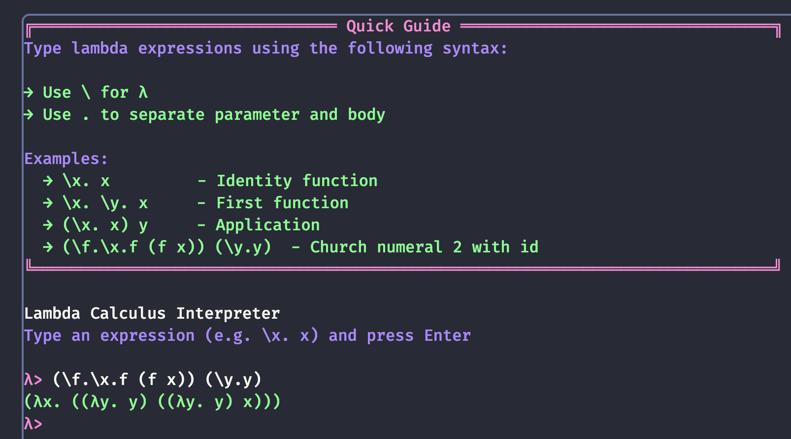

# λ-Calculus Interpreter

An interactive lambda calculus playground built with JavaScript. Try it live [here](https://chakshugautam.github.io/lc-interpreter/).



## About

This is a learning project to understand lambda calculus through implementation. The interpreter supports:
- Basic lambda calculus syntax
- Function abstraction and application
- Variable substitution
- Beta reduction
- Church numerals

I was reading [Haskell Book](https://haskellbook.com/) and wanted to implement the interpreter. I will document my journey once the interpreter is complete.

## Usage

If you are looking to work on the interpreter, you can run the following commands:
```bash
npm install
npm test
```

If you are planning to work on the cli/playground, you can run the following commands:
```bash
npm run dev
```

## TODO
- [x] Pass all interpreter tests ~~| 3 pending~~
- [ ] Add a linter
- [ ] Error Handling
  - [ ] Better error messages for syntax errors
  - [ ] Visual indication of error location
  - [ ] Type checking and validation
- [ ] Terminal Experience
  - [x] Command history (up/down arrows)
  - [ ] Clear screen command
  - [ ] Tab completion
  - [ ] Save/load expressions
- [ ] Beta Reduction Steps
  - [x] Show step-by-step reduction
  - [ ] Visual tree representation

## Resources

- [Writing a Lambda Calculus Interpreter in JavaScript](https://tadeuzagallo.com/blog/writing-a-lambda-calculus-interpreter-in-javascript-original/) - Excellent tutorial by [Tadeu Zagallo](https://github.com/tadeuzagallo) that I have mostly followed but changed where I couldn't follow.
- All the [www](./www) folder is generated through claude.

## Contributing

Please help me with the pending test cases on [interpreter.test.js](./tests/interpreter.test.js) and pointing mistakes in the interpreter. I have currently commented those out. I have also not completely grasped the interpreter written by [Tadeu Zagallo](https://github.com/tadeuzagallo) too.

## License

MIT